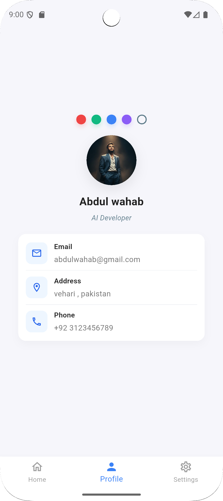

# 📱 Flutter Profile Card App

A simple and modern **Profile Card App** built with Flutter.  
It displays a user profile with picture, name, role, contact information, and a bottom navigation bar.

---

## 🚀 Features
- Gradient background with a clean profile card
- Profile picture with rounded avatar
- Name & profession text
- Edit Profile button with icon
- Contact information tiles:
    - 📧 Email
    - 📞 Phone
    - 📍 Address
- Stylish Bottom Navigation Bar

---

## 🖼️ Preview

  

