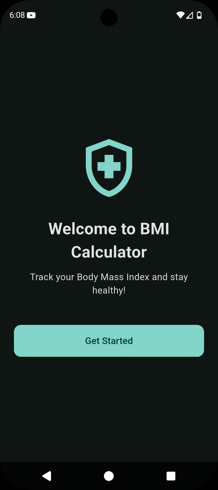
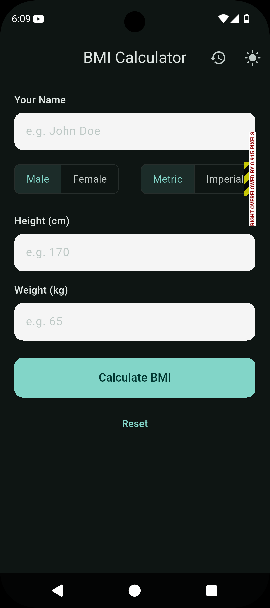
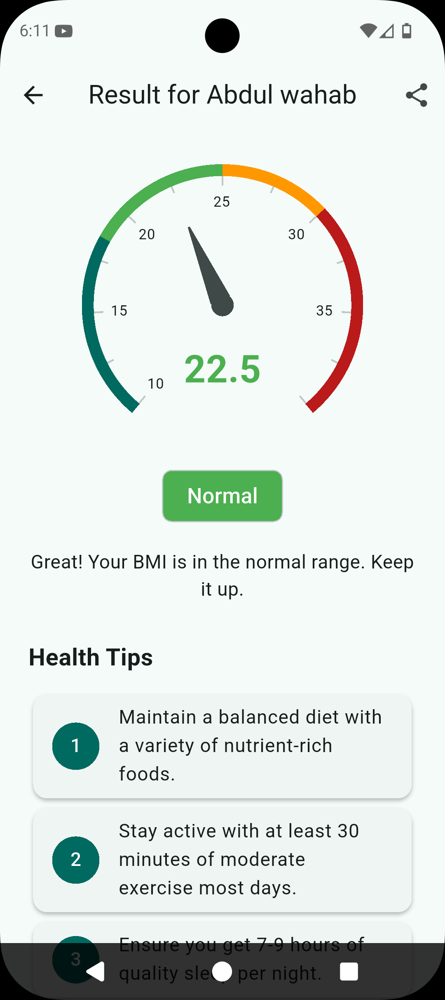

# BMI Calculator

A feature-rich and modern BMI Calculator application built with Flutter. This app provides a beautiful, intuitive, and personalized experience for calculating and tracking Body Mass Index (BMI).

## ✨ Features

-   **Stunning Welcome Screen:** A beautifully animated welcome screen greets users on the first launch.
-   **Personalized Inputs:** Enter your name and gender for a more tailored experience.
-   **Dual Unit System:** Seamlessly switch between **Metric** (kg/cm) and **Imperial** (lbs/in) units.
-   **Light & Dark Themes:** Choose between a gorgeous light or dark theme with a modern, seed-generated color palette.
-   **Engaging Result Screen:** View your BMI on an animated radial gauge with clear, color-coded categories.
-   **Actionable Health Tips:** Receive personalized health and wellness tips based on your BMI result.
-   **Comprehensive History:** Automatically saves your BMI calculations to a history screen. You can view past entries or clear the history at any time.
-   **Share Your Progress:** Easily share your BMI results with friends and family via a share button.
-   **Safe Exit Confirmation:** A confirmation dialog prevents accidental app closure.
-   **Polished UI/UX:** Smooth animations and a clean, modern design are implemented across the app for a great user experience.

## 📸 Screenshots

Here's a sneak peek of the app in action. Simply replace the `src` in the image tags with your screenshot paths.

| Welcome Screen                                     | Main Screen                                        |
| :------------------------------------------------: | :------------------------------------------------: |
|  |  |
|                   **Result Screen**                  |
| |

## 🚀 Getting Started

To get a local copy up and running, follow these simple steps.

### Prerequisites

-   You need to have the [Flutter SDK](https://flutter.dev/docs/get-started/install) installed on your machine.

### Installation

1.  **Clone the repository:**
    ```sh
    git clone https://github.com/your_username/your_repository.git
    ```
2.  **Navigate to the project directory:**
    ```sh
    cd your_repository
    ```
3.  **Install dependencies:**
    ```sh
    flutter pub get
    ```
4.  **Run the app:**
    ```sh
    flutter run
    ```
